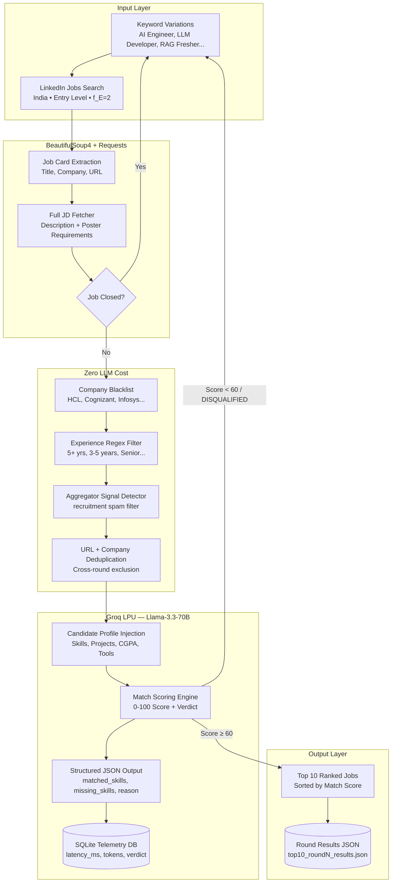

# 🤖 Agentic Job Pipeline — AI-Powered Job Discovery Engine


An end-to-end **Agentic AI Job Discovery & Evaluation Pipeline** built to eliminate the noise of modern job hunting. The system autonomously scrapes LinkedIn, applies precision pre-filters, and uses **Groq-powered LLM evaluation** (Llama-3.3-70B) to semantically score roles against a structured candidate profile — returning only the highest-match GenAI and AI Engineering opportunities.

Across **5 active rounds**, the pipeline has evaluated hundreds of job descriptions and surfaced the top-fit roles with zero duplicates between rounds.

---

## 🏗️ System Architecture



---

## ✨ Core Pipeline Features

### 1️⃣ Multi-Round Deduplication System
Every run loads all URLs and companies from all previous round JSON files (`top10_results.json` through `top10_round4_results.json`), ensuring **zero overlap** between rounds. Each new round also uses fresh keyword variants to expand discovery surface area.

### 2️⃣ Precision Pre-Filter Rules Engine (Zero LLM Cost)
Before any expensive LLM inference, the pipeline applies a layered rule-based filter:
*   **Company Blacklist:** Hardcoded exclusion of mass-hiring aggregators (HCL, Cognizant, Infosys, Virtusa, etc.)
*   **Experience Regex Filter:** Instantly disqualifies roles requiring `"5+ years"`, `"Senior"`, `"Lead"`, or `"10 years"` experience. Saves inference budget by ~60%.
*   **Aggregator Signal Detector:** Detects recruitment spam patterns in JD text.
*   **Closed Job Check:** Skips listings with `"no longer accepting applications"`.

### 3️⃣ LLM-Powered Semantic Evaluation (Llama-3.3-70B via Groq)
Each surviving JD is scored by the LLM against a structured **Candidate Profile** containing skills, projects, and target role criteria:
*   Outputs a **match score (0-100)**, a **verdict** (`Strong Match`, `Good Fit`, `Partial Fit`, `DISQUALIFIED`), matched & missing skill lists, and a plain-English reason.
*   Only jobs scoring `≥ 60` are accepted into the final results.

### 4️⃣ Vector Ranker (`core/vector_ranker.py`)
A secondary ranking pass using TF-IDF-based cosine similarity between the JD and candidate profile to reorder borderline candidates before final output.

### 5️⃣ SQLite Telemetry Logging
Every LLM call logs `latency_ms`, `prompt_tokens`, `completion_tokens`, `model_used`, `is_fallback`, and `verdict` to a local SQLite database — feeding the companion **LLMOps Observability Dashboard**.

---

## 📊 Pipeline Performance Across Rounds

| Round | Time Filter | Keywords | Jobs Evaluated | Jobs Passed | Top Score |
| :--- | :--- | :--- | :--- | :--- | :--- |
| **Round 1** | 7 days | 8 keywords | ~120 | 10 | 95 |
| **Round 2** | 7 days | 9 keywords | ~140 | 10 | 92 |
| **Round 3** | 7 days | 10 keywords | ~160 | 10 | 90 |
| **Round 4** | 7 days | 10 keywords | ~180 | 10 | 90 |
| **Round 5** | **48 hours** | 12 keywords | ~200 | 10 | **92** |

---

## 📂 Repository Structure

```
Agentic-Job-Pipeline/
├── core/
│   ├── llm_evaluator.py        # Groq LLM scoring engine + SQLite telemetry logger
│   └── vector_ranker.py        # TF-IDF cosine similarity reranker
├── scrapers/
│   └── linkedin_scraper.py     # LinkedIn DOM parser (BeautifulSoup4)
├── database/
│   └── outcome_log.db          # SQLite telemetry & application outcome log
├── ui/                         # Streamlit dashboard for job tracking
├── fetch_top10_round5.py       # Latest pipeline execution (48h strict filter)
├── fetch_top10_round4.py       # Round 4 pipeline (7-day, 10 new keywords)
├── fetch_top10_round3.py       # Round 3 pipeline
├── fetch_top10_round2.py       # Round 2 pipeline
├── fetch_top10_now.py          # Round 1 pipeline (baseline)
├── top10_round5_results.json   # Latest 10 qualified jobs
├── top10_round4_results.json   # Round 4 results
├── log_application.py          # Application outcome tracker
├── main.py                     # Streamlit UI entry point
└── .env                        # GROQ_API_KEY
```

---

## ⚡ Quick Start

1. **Clone the repository:**
   ```bash
   git clone https://github.com/Shiva-keerth/Agentic-Job-Pipeline.git
   cd Agentic-Job-Pipeline
   ```

2. **Install dependencies:**
   ```bash
   pip install requests beautifulsoup4 groq langchain python-dotenv
   ```

3. **Configure Environment:**
   ```env
   GROQ_API_KEY=your_groq_api_key_here
   ```

4. **Run the Latest Pipeline (Round 5 — 48h strict):**
   ```bash
   python fetch_top10_round5.py
   ```

---

## 🤝 Connect With Me
*   **GitHub:** [Shiva-keerth](https://github.com/Shiva-keerth)
*   **Focus:** Generative AI, RAG Systems, Agentic AI, and Machine Learning.
